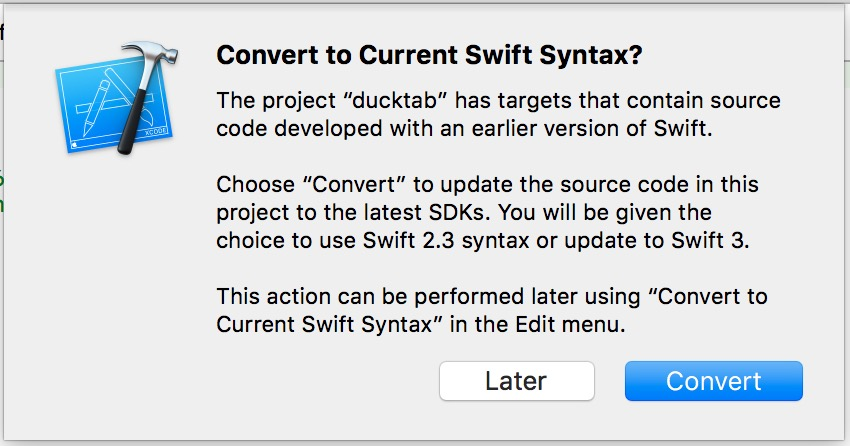
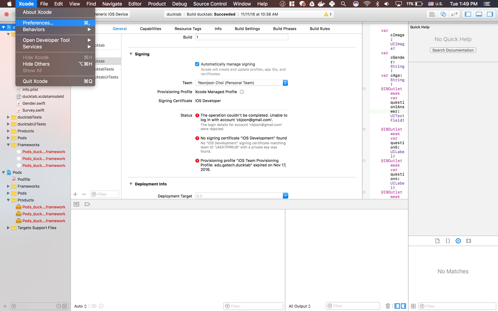
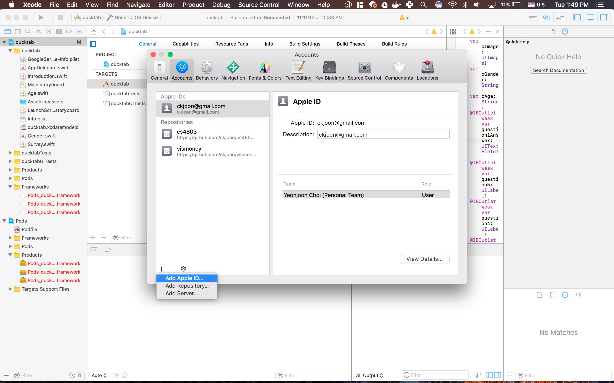
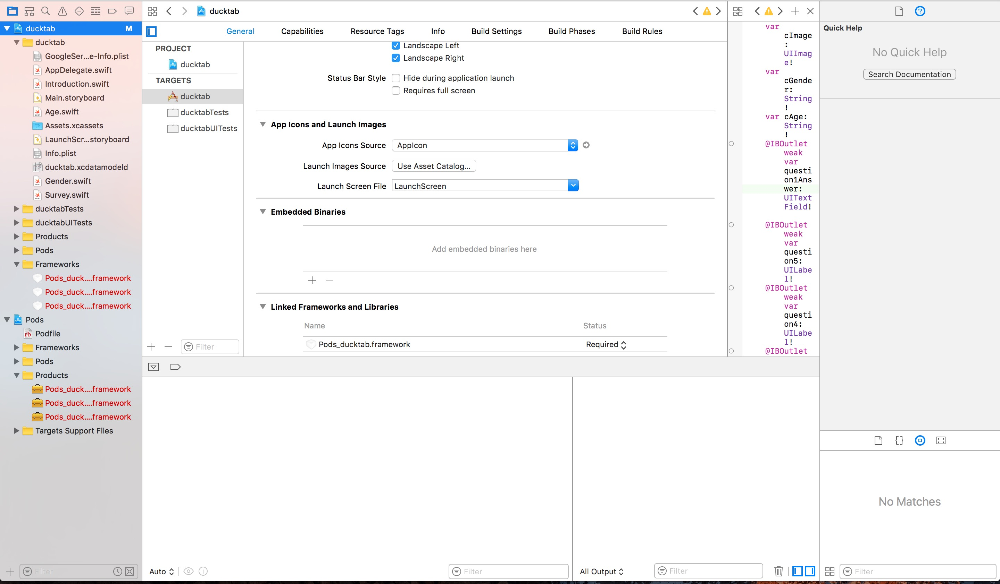
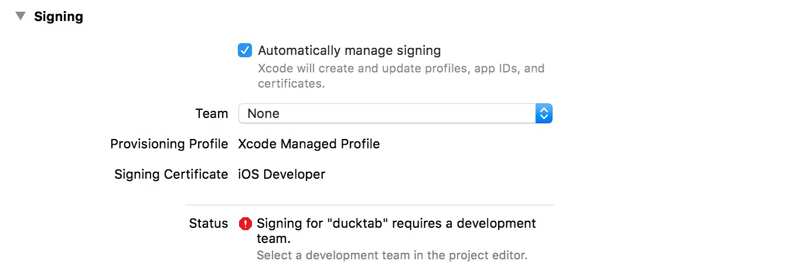

# Installation Guide For DuckTab Development (iPad)

Ducktab is an iPad application that patients can interact with in order to make wait time more worth.

### Requirements

#### Hardware
In order to develop ducktab application you would need:

* [MacBook] - Windows won't do. You would need to have Mac OS running hardware. Macbook is highly recommended.
* [iPad] - The application will run on primarily iPad Application. You would need to have iPad to test and deploy camera functionality. 

#### Software

Ductab requires [Xcode](https://developer.apple.com/xcode/downloads/) v8.0+ to run.

Ducktab uses [CocoaPod](https://cocoapods.org/) which is a dependency manager for Swift and Objective-C Cocoa projects.

### Installation Guide

Clone the git repository available here on github.
```sh
$ git clone https://github.com/ckjoon/cs4803.git 
```

#### Install Xcode
1. open appstore and search for  [Xcode](https://developer.apple.com/xcode/downloads)
2. Click install
#### Installing CocoaPod
open Terminal and type
```sh
$ sudo gem install cocoapods
```

Please watch this video if you encounter any problem installing cocoapod
[](https://www.youtube.com/watch?v=iEAjvNRdZa0&spfreload=10)

#### Install Pod Dependency
open terminal and cd into the directory and open the application
```sh
$ cd ducktab
$ Pod install
$ open ducktab.xcworkspace/
```


### Application 
1. Xcode will ask you to convert to the latest Swift. The application is developed with Swift 2.3 Convert at your own risk

2. Go to preference

3. Add your apple id for yo

4. Navigate to the set up page

5. Add your account to the sign in



